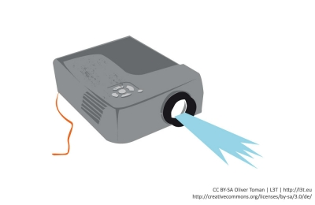

# Videoprojektor

Bei Videoprojektoren, umgangssprachlich als Beamer bezeichnet, wird ein Videosignal, zum Beispiel von einem Computer oder DVD-Player, auf eine Leinwand projiziert. Am Beginn der Projektion stand die von Christiaan Huygens 1656 erfundene **Laterna Magica** (lat. Zauberlaterne). Bis hinein in das 20. Jahrhundert galt sie als das Projektionsgerät. Es projizierte mit Hilfe einer internen Lichtquelle und spezieller Linsensysteme in schneller Reihenfolge Bilder durch das ausfallende Licht.

### !

Videoprojektoren (Beamer) sind als Vortragsmedien anzusehen, welche in Verbindung mit einem Computer die Projektion digitaler Inhalte ermöglichen.

### In der Praxis

Das Format, die Anschlüsse und die Auflösung des Beamers erhöhen die Fehlerquellen. Im Jahr 2005 war das 4:3 Format noch üblich, inzwischen gibt es fast nur noch 16:9 oder 16:10 Formate am Arbeitsplatz. Die Beamer haben jedoch ungleich längere Lebenszyklen und natürlich auch die Projektionsflächen in den Gebäuden. Das Gleiche gilt für die Auflösung, die oft noch 800*600 Bildpunkte betragen kann. Bei Präsentationen, speziell bei Vorführung von Software, kann das zu Problemen führen, wenn zum Beispiel Navigationselemente nicht mehr dargestellt werden. Beamer haben meist auch noch den berüchtigten VGA-Anschluss, aber moderne Ultrabooks unterstützen nur noch HDMI. Adapter können da nicht immer helfen.