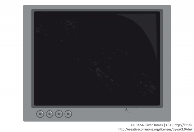

Ein Interactive Pen Display ist ein berührungsempfindlicher Bildschirm, auf dem man mit einem Stift (auch Stylus genannt) interagieren kann. Es lässt sich sehr gut mit den aufkommenden Tablet-Computern vergleichen.

Im Gegensatz zur Kreidetafel bieten Interactive Pen Displays durch den Anschluss an einen Computer digitalen Inhalt. Man kann alles speichern, bearbeiten, löschen und kopieren. Der Schreibaufwand, den Lehrende und Studierende haben, ist sowohl bei der Tafel als auch bei den Interactive Pen Displays der gleiche.

### !

Interactive Pen Displays erlauben die Erweiterung von herkömmlichen Laptops um einen berührungsempfindlichen Bildschirm.