### File: von_der_kreidetafel_zum_tablet.md

# Von der Kreidetafel zum Tablet

## Eine technische Übersicht

Ausgewählte Endgeräte werden in historischer Reihenfolge vorgestellt, unter anderem die analoge Kreidetafel, das Whiteboard sowie Fernseher, Laptop und Beamer bis hin zum interactive Pen Display, zur Papershow und dem iPad. Die einzelnen Übersichten geben eine technische Beschreibung, bieten kurze Reflexionen und verweisen auf weiterführende Quellen. Das Kapitel schließt mit Kurzbeschreibungen aktueller Geräte auf dem Markt, die Potenzial im Bildungsbereich haben. Letzteres ist aus derzeitiger Sicht spekulativ und es wird sich erst zeigen, inwieweit sie am Bildungsmarkt Fuß fassen können. Bei allen Beschreibungen liegt der Fokus auf den technischen Daten und Funktionalitäten der Geräte und weniger auf den unterschiedlichen Einsatzmöglichkeiten im Klassenzimmer und Seminarraum.

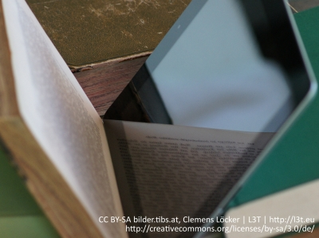

Version 2013  
CC BY-SA L3T | [http://l3t.eu](http://l3t.eu)  
[http://creativecommons.org/licenses/by-sa/3.0/de/](http://creativecommons.org/licenses/by-sa/3.0/de/)

---

### File: einleitung.md

# Einleitung

Hilfsmittel und Geräte, die im Unterricht zum Einsatz kommen, gibt es schon lange, aber es gibt sie keineswegs „schon immer“. Eines der ersten Hilfsmittel waren Ende des 17.Jahrhunderts Schulbücher. Wir haben versucht jene Geräte auszuwählen, die heute noch in den Ausbildungsräumen anzutreffen sind. Darunter befinden sich die Schultafel, aber auch viele digitale Endgeräte. Ein Schwerpunkt liegt dabei auf Geräten, die bei der Präsentation im Unterricht eingesetzt werden, beispielsweise Kreidetafeln, Whiteboards und Projektoren. Im Ausblick stellen wir vergleichsweise aktuelle Technologien vor, zum Beispiel Laptops, Interactive Pens und Tablets. Bei der Beschreibung stehen technisch-funktionale Aspekte im Vordergrund. Die Software beziehungsweise Apps werden nicht behandelt.

### !

Weiterführende Links zum Kapitel finden Sie in der L3T-Gruppe bei Diigo unter Verwendung der Hashtags #l3t und #ipad.

### ?

Ordnen Sie die verschiedenen Endgeräte (TV, Laptop, Kreidetafel, Tablet, Diaprojektor, Smartphone) in historischer Reihenfolge beginnend mit dem Ältesten!

---

### File: kreidetafel.md

# Kreidetafel

Die Kreidetafel ist seit dem 17.Jahrhundert bekannt und prägt auch heute noch fast jede Lehrveranstaltung. Schrift wird mittels Kreide auf Tafeln übertragen, die in unterschiedlichen Farben erhältlich ist. Um diese zu entfernen, werden Schwämme beziehungsweise feuchte Tücher verwendet. Funktional dient die Kreidetafel vor allem bei der Kurzzeitspeicherung von visuellen Informationen. Sie unterstützt primär das gesprochene Wort des der Lehrenden durch grafische Darstellungen.

Ein Nachteil dieser Art von Unterrichtstechnologie besteht darin, dass sich die Lehrenden vom Publikum abwenden müssen und sich somit Erklärungen und Erläuterungen der Darstellung als sehr schwierig erweisen. Die Zuhörer/innen sind meist vorwiegend damit beschäftigt, die Inhalte zu duplizieren und in ihre „Hefte“ zu kopieren, statt Inhalte zu reflektieren. Als Vorteil der Kreidetafel wird jedoch das Unterrichtstempo beschrieben, welches an den Vorlesungsstoff angepasst ist. Das Schreiben und gleichzeitige laut Nachdenken wird vor allem in den Naturwissenschaften als sehr positiv wahrgenommen (Rojas et al., 2001, 32-37).

Die Kreidetafel wird hauptsächlich im klassischen Unterricht eingesetzt, welcher primär durch eine/n vortragende/n Lehrende/n und viele zuhörende Lernende gekennzeichnet ist.

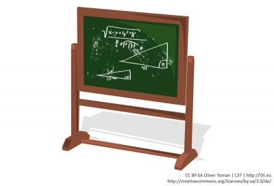

### !

Als Vorteil der Kreidetafel wird das Unterrichtstempo beschrieben, welches an den Vorlesungsstoff angepasst ist.

### ?

Welche Nachteile kann speziell die Kreide bei der Kreidetafel haben?

---

### File: whiteboard.md

# Whiteboard

1990 eingeführt gilt die weiße Tafel, das „Whiteboard“, als Weiterentwicklung der Kreidetafel und wird anstatt mit Kreide mit sogenannten Whiteboard-Stiften, speziellen abwischbaren Filzstiften, beschrieben. Wie bei der Kreidetafel wird für die Herstellung Kunststoff oder Stahlemaille verwendet. Bei Verwendung von Stahlemaille kann ein Whiteboard auch als Magnettafel fungieren. Um Aufschriften von einem Whiteboard zu entfernen, wird ein trockenes Tuch oder ein trockener Schwamm verwendet. Ein Vorteil gegenüber der Kreidetafel ist, dass beim Beschreiben und Löschen der Tafel kein Staub entsteht, jedoch ist das mit Stiften Geschriebene oft schwerer für das Auditorium lesbar.
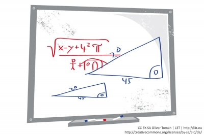

---

### File: interaktives_whiteboard.md

# Interaktives Whiteboard

Nicht direkt als Weiterentwicklung, aber durch die Namensgleichheit schwer unterscheidbar, ist das „interaktive“ Whiteboard, oft auch nach dem Marktführer „Smart Board“ genannt. Hier ist meist eine kleine interaktive Tafel gemeint, auf der ein Monitorbild zu sehen ist, das man per Hand oder mit Computer-Stiften bemalen kann. Das Bild wird entweder per Beamer, der unmittelbar über der Tafel angebracht ist, oder mittels großem Touchscreen dargestellt. Spezielle Software unterstützt dabei die Stifte und bindet sich in Standardlösungen (wie Powerpoint und Internet Explorer) ein. Die gesamte Software befindet sich beispielsweise im Anschlusskabel und wird bei Anschluss auf einem Präsentationsrechner installiert. Das Whiteboard selbst hat keinen Rechner.

Der Vorteil ist die Kombination aus Altem und Neuem. So kann man fast wie mit der Kreidetafel arbeiten, zum Beispiel per Stift mehrfarbig zeichnen und zum Löschen einfach mit dem Handballen wischen. Hinzu kommt die Möglichkeit, das Tafelbild digital zu speichern. Bei Powerpoints kann man nun auch Anmerkungen aktiv einzeichnen oder digitale Inhalte aus dem Netz (zum Beispiel Google Maps) vorführen. Videos (zum Beispiel von YouTube und Vimeo) können mit den eingebauten Lautsprechern abgespielt werden. Mit der Undo- und Redo-Funktionen können sehr schnell vorbereitete Zeichnungen dargestellt und quasi als Stop-Motion-Film vorgeführt werden. Leider steht man auch hier meist mit dem Rücken zum Auditorium. Es gibt jedoch Möglichkeiten, den Beamer auch per Laptop oder Tablet zu bedienen.

### !

Johnny Lee Chung hat das Wii-Remote-Projekt als Open Source veröffentlicht, damit die Entwicklung auch nachhaltig und offen ist. Inzwischen gibt es ähnliche Ansätze auch für Virtual-Reality-Displays und für die Xbox Kinect. Infos unter [http://johnnylee.net/projects/wii/](http://johnnylee.net/projects/wii/).

---

### File: diaprojektor.md

# Diaprojektor

Der zu der Familie der Durchlichtprojektoren (Diaskope) zählende Diaprojektor wurde 1926 von Leitz (Wetzlar) entwickelt. Der Diaprojektor wird verwendet, um durchsichtige, unbewegliche und meist durch Photographie gewonnene Bilder, kurz Diapositive, darzustellen. Diese Bilder haben meist eine Größe von 24 x 36 mm und liegen in einem 50 x 50 mm Diarahmen. Neben den konventionellen Dias gibt es auch Diastreifen, auf denen sich mehrere Bilder nebeneinander befinden. Trotz verschiedenster Hersteller (welche sich in Konstruktion und Leistung unterscheiden), basieren alle Projektoren auf dem Prinzip: „Das von der Lichtquelle (Lampe) ausgestrahlte Lichtbündel wird durch den Kondensor gesammelt, durchstrahlt nun als Bündel annähernd paralleler Lichtstrahlen das zur Projektion bestimmte Bild – das Dia – und wird durch das Objektiv auf die Projektionsfläche geworfen“ (Melezinek, 1999, 117).

Grundsätzlich unterscheidet man zwischen nichtautomatischen, halb- und vollautomatischen Diaprojektoren. Nichtautomatische Projektoren müssen von Hand bedient werden, während halb- und vollautomatische Projektoren mit Diamagazinen ausgestattet sind und mittels Fernbedienung bedient werden. Der Aufwand und die Kosten von analogen Bildern stehen heutzutage in keinem Vergleich zur digitalen Produktion. Die Herstellung wird nur noch von Spezialistinnen und Spezialisten zu entsprechenden Kosten durchgeführt.
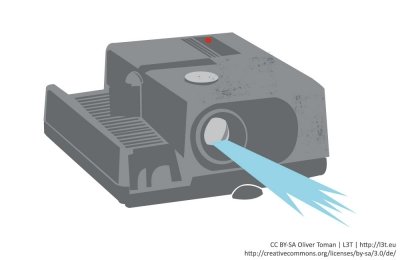

---

### File: tageslichtprojektor.md

# Tageslichtprojektor

Der Tageslichtprojektor, auch Overhead-Projektor (Österreich, Westdeutschland), Polylux (Ostdeutschland) oder Hellraumprojektor (Schweiz) genannt, wurde 1960 von der Firma 3M entwickelt. Er projiziert mittels eines Bildwerfers den Inhalt transparenter Folien auf eine Projektionsfläche, ohne dass der Raum stark verdunkelt werden muss.

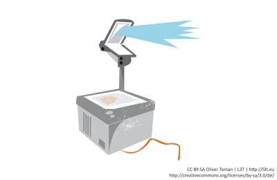

### !

Der Tageslichtprojektor bietet den Vorteil, dass die Vortragenden in ständigem Blickkontakt mit dem Publikum bleiben, Folien beliebig austauscht werden können und die natürliche Schreibhaltung unterstützt wird (Blömecke, 2005, 76-97).

Als Medium dient vorwiegend eine transparente Folie, in Form von einzelnen Blättern oder als Folienrolle, welche aus Polyacetat, Polyester und Ähnlichem besteht. Auch das Bedrucken von Spezialfolien mit Bildern ist möglich. Durch Realobjekte werden Schattenprojektionen ermöglicht. Als Weiterentwicklung wird der Einsatz von LC-Displays (Liquid-Crystal-Displays) angesehen, bei dem ein Bildschirm auf den Tageslichtprojektor gelegt und durch dessen Lichtquelle durchleuchtet wird. Durch diese Technik können Inhalte von Computern auf der Projektionsfläche großformatig dargestellt werden.

Der Tageslichtprojektor projiziert mit dem gleichen Prinzip wie der Diaprojektor: Der Lichtstrom von der Lichtquelle (Lampe) leuchtet über einen Kondensor (Fresnel-Linse) gleichmäßig die Arbeitsplatte (Glasplatte) aus und wird durch den auf der Arbeitsplatte aufgelegten Informationsträger hindurch über den Projektionskopf (zum Beispiel zwei Linsen, Umlenkspiegel) zur Projektionsfläche abgestrahlt. Andere Ausführungen bieten zum Beispiel einen Parabolspiegel, bei dem der Objektivkopf zusätzlich die Lichtquelle beinhaltet.

Tageslichtprojektoren haben auch heute noch eine sehr weite Verbreitung und sind vielerorts im Einsatz.

---

### File: epiprojektor.md

# Epiprojektor (Episkop) / Visualizer

Der episkopische Projektor kann undurchsichtiges (opakes) Normalpapier projizieren. Dies ist vorteilhaft, da man aktuelle Informationen, ohne diese in ein Diapositiv oder ein Transparent umzuarbeiten, direkt projizieren kann.

Das Darstellungsprinzip des Epiprojektors ist dabei die „Auflichtprojektion“. Die zu projizierende Vorlage wird auf eine Platte am Boden des Episkops gelegt und mit einer oder mehreren Lampen beleuchtet. Das von der Vorlage diffus reflektierte Licht wird über einen Spiegel zum Projektionsobjektiv geführt und weiter auf eine Projektionsfläche geworfen. Auf Grund der geringen Lichtausbeute ist es notwendig, den Unterrichtsraum zu verdunkeln.

Der größte Vorteil dieser Art von Projektion ist, dass die Vorlagen ohne weitere Aufbereitung unter das Gerät gelegt werden können. Auch Objekte mit Übergröße sind möglich, da der Kopf des Epiprojektors abgenommen und über das Objekt bewegt werden kann.

Die Weiterentwicklung des Episkops ist der Visualizer. Hier wird eine hochauflösende Kamera genutzt, um den beleuchteten Gegenstand zu filmen und dann das Bildsignal digital oder analog an einen Overhead-Projektor oder einen Beamer, an ein interaktives Whiteboard oder eine Webkonferenz weiterzuleiten. Technisch kann man so alle Gegenstände dreidimensional erfassen und problemlos darstellen.

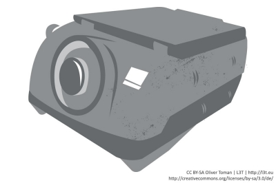

---

### File: fernseher_monitor_videorekorder_dvd_player.md

# Fernseher, Monitor, Videorekorder, DVD-Player

Der uns heute bekannte Fernseher geht auf ein Patent von Paul Nipkow im Jahre 1886 zurück, der den ersten mechanischen Fernsehapparat erfand. Später folgte der analoge Röhrenmonitor und heute der bekannte digitale Flachbildschirm, den man in LCD-, LED- und Plasma-Flachbildfernseher einteilen kann. Die Standardauflösung ist inzwischen HD und teilweise wird auch 3D unterstützt. Das Nachfolgeformat UHD (auch 4k oder 8k genannt) wird schon ausgeliefert, es mangelt jedoch an Abspielgeräten und Medien.

Um Filme aufzuzeichnen und erneut abspielen zu können, wurde der Videorekorder entwickelt. Das verwendete Medium war ein Magnetband, das mehrere Male verwendet werden konnte (Überspielen), inzwischen wurde der Videorekorder jedoch durch den Harddiskrekorder abgelöst. Mit Einzug der DVD (Digital Versatile Disc) im Jahr 1996 kamen auch die DVD-Player, die durch eine höhere Kapazität und das digitale Format Videos in höherer Qualität erlauben. Als Weiterentwicklung heutzutage gilt die Blu-ray-Disc. Beide Angebote erhalten jedoch durch Streaming-Angebote (unter anderem YouTube, Maxdome und iTunes) aus dem Internet starke Konkurrenz. Durch die Einführung von Lehrvideos wurde fälschlicherweise angenommen, dass ein erhöhter Lernerfolg durch alleiniges Betrachten der Filme eintrete (Salomon, 1984,647-658). Heute spielt diese Form des Unterrichts eine eher untergeordnete Rolle oder findet sich unter dem Schlagwort „Multimedia“ (siehe Kapitel #multimedia) wieder.

Da große Bildschirme sehr teuer sind, werden in der Praxis oft Beamer eingesetzt.

---

### File: touchscreen.md

# Touchscreen

Die ersten Touchscreens wurden schon 1940 entwickelt und schließlich mit Veröffentlichung der PLATO-IV-Lernmaschinen 1972 publik gemacht. Bei Touchscreens interagiert man mit einem Computer durch Berührung des Bildschirmes. Statt der Bedienung durch einen mit der Maus bewegten Cursor, wird auf direkte Eingaben mit Finger und Zeigestift (einem sogenannten Stylus) gesetzt.

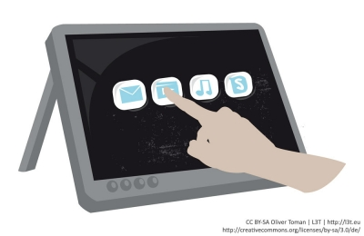

Früher vorwiegend bei Info-Monitoren, Computer-Kiosks und Bankomaten verwendet, finden wir Touchscreens heutzutage in Mobiltelefonen, Tablet-PC, Laptop, MP3-Player und Ähnlichem. Man unterscheidet folgende Funktionsprinzipien:

- **Resistive Touchscreens:** Wenn zwei elektrisch leitfähige Schichten per Druck aneinander geraten, entsteht ein Spannungsteiler, an dem der elektrische Widerstand und so die Position der Druckstelle gemessen wird. Verwendung findet diese Technologie bei Kiosksystemen, Tablet-PCs oder Industrie-PCs.
- **Kapazitive Touchscreens:** Bei kapazitiven Touchscreens werden mit Metalloxid beschichtete Glassubstrate oder zwei Ebenen aus leitfähigen Streifen verwendet. Bei der ersten Methode wird ein elektrisches Feld erzeugt, bei dem die elektrischen Ströme aus den Ecken im direkten Verhältnis zur Berührungsposition stehen. Bei der zweiten Methode bilden die zwei Ebenen Sensor und Treiber. Bei Berührung verändert sich die schwache Kapazität des Kondensators und ein größeres Signal kommt beim Sensor an. Verwendung findet diese Technologie bei den Apple-Produkten (iPhone, iPad, iPod) sowie bei Mobiltelefonen von HTC und Samsung.

- **Induktive Touchscreens:** Diese Technologie findet vor allem bei Grafiktablets Verwendung. Die Technik basiert auf elektromagnetischer Basis ohne direkten Bildschirmkontakt. Ein spezieller Stift (Stylus) muss eingesetzt werden, um Interaktion mit dem Bildschirm zu erkennen. Er kommuniziert über hochfrequente Signale mit sehr kleinen Antennenspulen in der Sensor-Leiterplatte. Dabei ist eine sehr exakte Positionsbestimmung über den Resonanzkreis möglich.
- **Optische Touchscreens:** Es kommen Lampen und lichtempfindliche Sensoren zum Einsatz. Wird durch Berührung das Lichtschranken-Gitter durchbrochen, kann der Punkt der Berührung ermittelt werden. Diese Technologie ist sehr fehleranfällig, da Staub auf die Sensoren gelangen und unerwünschte Reaktionen hervorrufen kann. Zum Einsatz kommen optische Touchscreens vor allem bei großen Bildschirmen. Als bekanntestes Beispiel sei auf das Produkt „Microsoft Surface“ verwiesen.

### In der Praxis

Die kapazitiven Touchscreens haben sich inzwischen flächendeckend durchgesetzt. Die großen Nachteile, dass man sie nicht per Handschuh bedienen kann und die größere Ungenauigkeit, spielen in der Praxis kaum eine Rolle. Dafür sind sie verschleißfrei, unterstützen Multi-Touch und reagieren beim Transport in der Hosen oder Handtasche nicht ungewollt auf Druck. Die große Ausnahme sind jedoch die Samsung-Galaxy-Note-Hybrid-Modelle, die beide Technologien unterstützen. Es wird die kapazitive Technik für die Handeingabe verwendet und die induktive für den Pen, wobei die induktive Technik eine höhere Priorität hat.

---

### File: videoprojektor.md

# Videoprojektor

Bei Videoprojektoren, umgangssprachlich als Beamer bezeichnet, wird ein Videosignal, zum Beispiel von einem Computer oder DVD-Player, auf eine Leinwand projiziert. Am Beginn der Projektion stand die von Christiaan Huygens 1656 erfundene **Laterna Magica** (lat. Zauberlaterne). Bis hinein in das 20. Jahrhundert galt sie als das Projektionsgerät. Es projizierte mit Hilfe einer internen Lichtquelle und spezieller Linsensysteme in schneller Reihenfolge Bilder durch das ausfallende Licht.

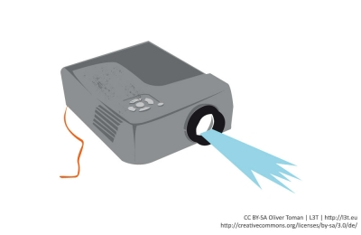

### !

Videoprojektoren (Beamer) sind als Vortragsmedien anzusehen, welche in Verbindung mit einem Computer die Projektion digitaler Inhalte ermöglichen.

### In der Praxis

Das Format, die Anschlüsse und die Auflösung des Beamers erhöhen die Fehlerquellen. Im Jahr 2005 war das 4:3 Format noch üblich, inzwischen gibt es fast nur noch 16:9 oder 16:10 Formate am Arbeitsplatz. Die Beamer haben jedoch ungleich längere Lebenszyklen und natürlich auch die Projektionsflächen in den Gebäuden. Das Gleiche gilt für die Auflösung, die oft noch 800*600 Bildpunkte betragen kann. Bei Präsentationen, speziell bei Vorführung von Software, kann das zu Problemen führen, wenn zum Beispiel Navigationselemente nicht mehr dargestellt werden. Beamer haben meist auch noch den berüchtigten VGA-Anschluss, aber moderne Ultrabooks unterstützen nur noch HDMI. Adapter können da nicht immer helfen.

---

### File: pc_laptop_und_netbook.md

# PC, Laptop und Netbook

Der erste elektronische Computer wurde um 1938-1945 von Konrad Zuse entwickelt. Der erste Laptop, ein mobiler Personal Computer, wurde im Jahr 1975 von IBM vorgestellt, der IBM 5100. Später, im Jahr 1980, kam der erste, wie uns heute bekannte, Laptop heraus (Flip-Form). Im Gegensatz zu früher kann man Laptops heute mit Stand-PCs vergleichen, da dieselbe Leistung auf immer kleineren Raum gebracht werden kann. Die kleinste Version eines Laptops wird heute als Netbook bezeichnet. Dieses hat oftmals nur eine geringe Leistung und wird daher eher als leichter Reisebegleiter verwendet.

PCs und Laptops durchdringen immer mehr die Unterrichtsräume, die Zunahme an Netbooks kann ebenfalls immer mehr beobachtet werden (siehe Kapitel #schule). Kritische Stimmen meinten anfangs, dass man nun einen etwas besseren Taschenrechner hätte, aber die Vielfalt der Möglichkeiten, die sich dadurch ergeben, ist heute noch immer eine der wesentlichen Fragestellungen des Forschungsgebietes technologiegestütztes Lehren und Lernen.

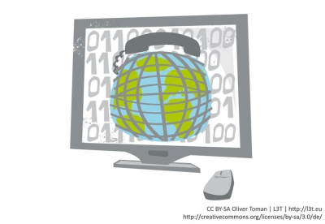

---

### File: interactive_pen_display.md

# Interactive Pen Display

Ein Interactive Pen Display ist ein berührungsempfindlicher Bildschirm, auf dem man mit einem Stift (auch Stylus genannt) interagieren kann. Es lässt sich sehr gut mit den aufkommenden Tablet-Computern vergleichen.

Im Gegensatz zur Kreidetafel bieten Interactive Pen Displays durch den Anschluss an einen Computer digitalen Inhalt. Man kann alles speichern, bearbeiten, löschen und kopieren. Der Schreibaufwand, den Lehrende und Studierende haben, ist sowohl bei der Tafel als auch bei den Interactive Pen Displays der gleiche.

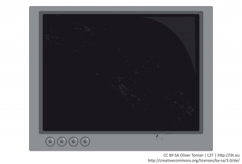

### !

Interactive Pen Displays erlauben die Erweiterung von herkömmlichen Laptops um einen berührungsempfindlichen Bildschirm.

---

### File: papershow.md

# Papershow

Papershow eignet sich sehr gut, um komplizierte handschriftliche Inhalte, zum Beispiel Formeln, Herleitungen oder Skizzen, schnell und deutlich digital wiederzugeben und auch aufzuzeichnen. Man zeichnet mit einem fast normalen Stift auf Spezialpapier. Eine kleine eingebaute Stift-Kamera zeichnet dann die Schrift auf. In Zusammenarbeit mit dem Papierraster des mitgelieferten Spezialpapiers erkennt der Stift die Position und überträgt das Schriftbild sehr genau 1:1 kabellos per Bluetooth auf den Rechner. Farben und Schriftstärke können auch über das Spezialpapier geändert werden. Die Nutzer/innen müssen sich also nicht umgewöhnen und können wie gewohnt mit Stift und Papier auch komplexe Sachverhalte aus Physik, Mathematik oder der Kunst schnell und vertraut darstellen. Für die Nachhaltigkeit kann man dies dann auch gleich per Screencast aufzeichnen und archivieren.

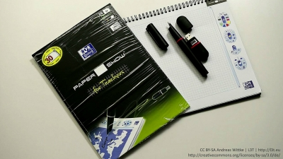

---

### File: smartphone.md

# Smartphone

Im Jahr 2013 haben über 31 Millionen Deutsche ein Smartphone. Ausgestattet mit hochauflösender Kamera, Internet, GPS-Modulen und Touch-Displays wurden Smartphones vor allem durch die zur Verfügung stehenden Anwendungen (engl. „applications“, kurz Apps) populär. Seit Jahren wird Forschung zum mobilen Lernen („M-Learning“, siehe Kapitel #mobil) betrieben. Der Einsatzbereich der Smartphones in der Lehre ist quasi unendlich, erfordert jedoch spezielle Software und bestimmte Hardware-Konzepte z.B. BYOD (Bring Your Own Device). Der Vor- und gleichzeitige Nachteil sind die schnellen Produktionszyklen von Hard- und Software. Jedes Jahr kommen neue Modelle heraus und die Software aktualisiert sich noch schneller. Vertraute Bedienkonzepte oder Dokumentationen sind schnell veraltet. Fehler in der Software oder dringend benötigte Features können abrupt verschwinden oder erscheinen. Die Anwender/innen benötigen eine hohe technische Affinität und Medienkompetenz.

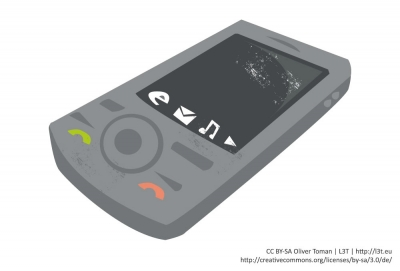

---

### File: tablet.md

# Tablet

Eine der wichtigsten Zukunftstechnologien unserer Zeit sind die Tablet-Computer. Es werden pro Jahr ca. 200 Millionen Stück verkauft, davon entfallen ca. 31% auf Apple, der Rest ist zumeist Android. Tablets eignen sich ideal für den Unterricht, da sie nicht hochfahren müssen, keine Lüfter besitzen und die Tastatur lautlos ist. Mittels Adapter lässt sich das Tablet für Präsentationen an einen Beamer anschließen. Durch spezielle Bildungs-Apps werden diverse didaktische und technische Szenarien unterstützt.

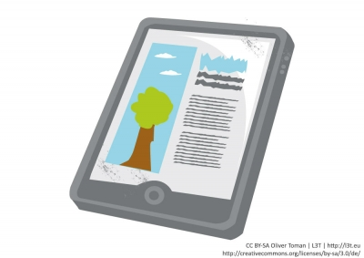

Verantwortlich für die Usability eines Tablets ist unter anderem die verwendete **Multi-Touch-Technologie** beim iPad oder die Hybrid-Technologie beim Galaxy Note. Dank Touchscreen können nun ohne Probleme in verschiedensten Anwendungen Anmerkungen auf dem Bildschirm per Hand oder Pen gemacht werden.

Nach und nach bringen nun auch, neben Apple, andere PC-Anbieter wie HP, Lenovo, Amazon und Microsoft Tablet-Geräte auf den Markt. Viele dieser Geräte punkten mit besonderen Funktionen, zum Beispiel abnehmbare Tastaturen, Pens, Voice Commands oder Gestensteuerung. Was allen jedoch gleicht ist: Es wird alles billiger, schneller und benutzerfreundlicher.

---

### File: fazit.md

# Fazit

Dieses Kapitel zeigt die Vielfalt an Technologien in den heutigen Unterrichtsräumen auf und auch, was man von ihr erwarten kann. Gemein ist ihnen, dass jede Einführung immer mit großen Schwierigkeiten verbunden war, ihrer Verwendung viel Skepsis entgegengebracht wurde und sie trotzdem letztendlich nicht aufzuhalten waren.

### ?

Überlegen Sie darüber hinaus, wie sich die Lehre verändern könnte, wenn man mit modernen Technologien (zum Beispiel Touch-Screens) arbeitet.

### ?

Erstellen Sie eine tabellarische Übersicht, in der Sie die Vor- und Nachteile aller Geräte im Lehr- und Lerneinsatz festhalten. Beschreiben Sie dabei auch, in welchem Lehr- oder Lernarrangement sie idealerweise zum Einsatz kommen.
